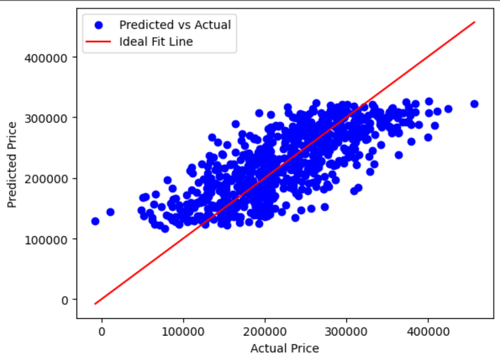
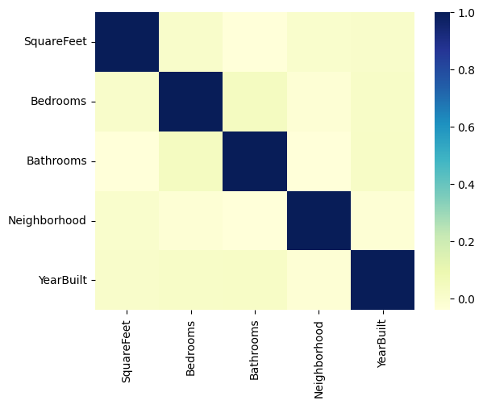

# 🏠 House Price Prediction using Machine Learning

A machine learning project to predict house prices using **Linear Regression** and classify them as above or below average using **Logistic Regression**. This notebook demonstrates data preprocessing, feature scaling, regression modeling, classification, and performance visualization.

---

## 📊 Project Overview

This project explores a real estate dataset to:

- Predict the **exact house price** using Linear Regression
- Classify whether a house is **above or below the average price** using Logistic Regression

---

## ⚙️ Technologies Used

- Python, Pandas, NumPy
- scikit-learn (LinearRegression, LogisticRegression, MinMaxScaler)
- Seaborn & Matplotlib for visualizations

---

## 🧠 ML Workflow

1. **Data Cleaning** – Remove nulls & duplicates
2. **Feature Engineering** – Encode categorical data
3. **Feature Scaling** – Min-Max normalization
4. **Linear Regression** – Price prediction
5. **Logistic Regression** – Price category classification
6. **Model Evaluation** – RMSE, accuracy
7. **Visualization** – Scatter plots & correlation heatmaps

---

## 📈 Visual Results

### 🔵 Predicted vs Actual Prices

*Visualizing how close the predicted prices are to the actual prices using Linear Regression.*

---

### 🔥 Feature Correlation Heatmap

*Heatmap to assess multicollinearity between features before training the model.*

---

## 📊 Performance Summary

| Model              | Metric         | Score     |
|-------------------|----------------|-----------|
| Linear Regression | RMSE Accuracy  | ~78%      |
| Logistic Regression | Classification Accuracy | ~81% |

---

## 📂 Files in This Repo

- `house_price_prediction_ml.ipynb` — Notebook containing full code
- `images/` — Visualizations included in README
- `README.md` — This file

---

## 🚀 How to Run

1. Clone the repo:
   ```bash
   git clone https://github.com/naomi-afrin/house-price-prediction-ml.git
   cd house-price-prediction-ml

---

## 📬 Contact

**Author:** Naomi Afrin Jalil  
📧 Email: naomiarin12@gmail.com  
🔗 [LinkedIn](https://www.linkedin.com/in/naomi-jalil-240160227/)

---
